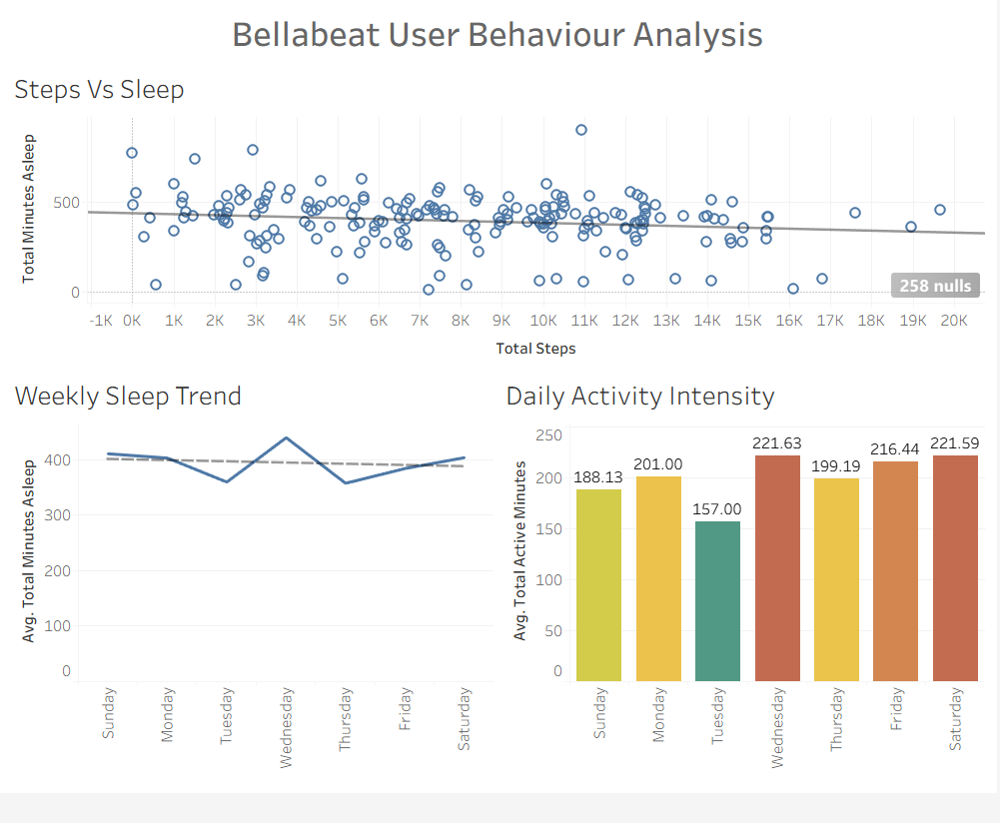

# Bellabeat Tableau Dashboard

## 📊 Dashboard Preview

## 📊 Project Overview
This project analyzes Bellabeat fitness tracker data to uncover user activity trends and provide business insights for decision-making.

## 🛠 Tools Used
- Tableau
- SQL
- Excel

## 🔍 Key Insights
- Daily activity and calorie trends
- Sleep vs activity relationship
- User engagement patterns

## 📁 Files
- Bellabeat Case Study - SQL Analysis.twbx (Dashboard)
- Bellabeat Case Study - Report.pdf

## 🚀 Outcome
This dashboard helps stakeholders understand user behavior and make data-driven decisions.
